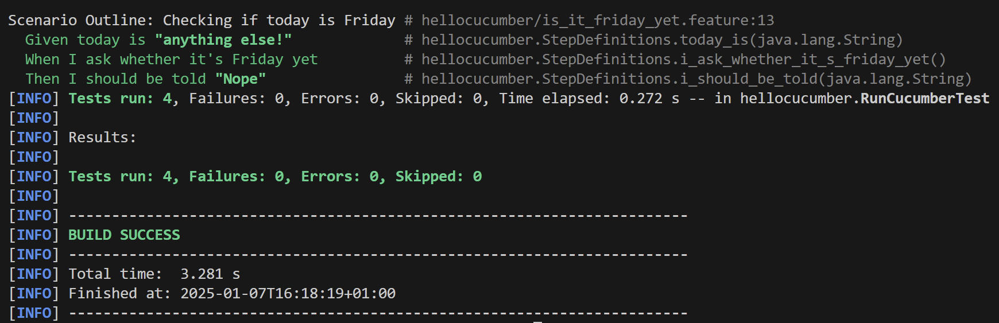
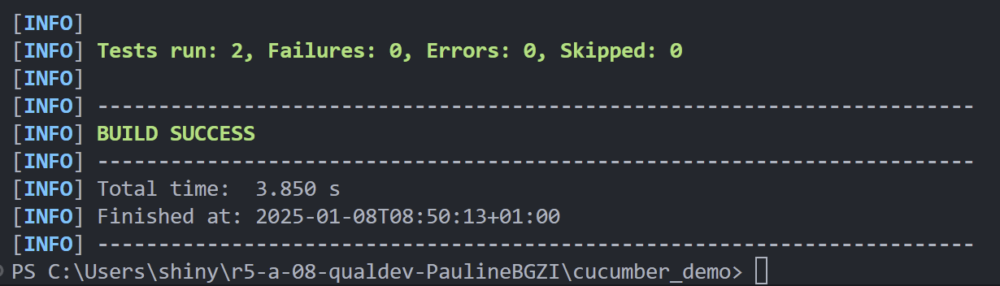
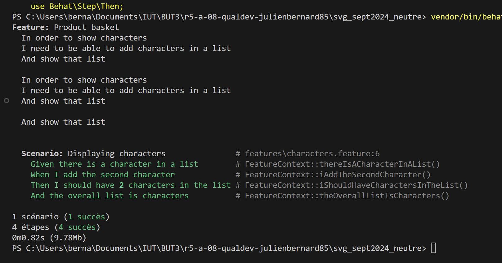

= R5.A.08 -- Dépôt pour les TPs
:icons: font
:MoSCoW: https://fr.wikipedia.org/wiki/M%C3%A9thode_MoSCoW[MoSCoW]

Ce dépôt concerne les rendus de mailto:pauline.beng-houzi@etu.univ-tlse2.fr[Pauline Benghouzi].

== TP1

.is_it_friday_yet.feature
[source,java]
---
Feature: Is it Friday yet?
  Everybody wants to know when it's Friday
  Scenario Outline: Checking if today is Friday
    Given today is "<day>"
    When I ask whether it's Friday yet
    Then I should be told "<answer>"
    Examples:
      | day            | answer |
      | Friday         | TGIF   |
      | Sunday         | Nope   |
      | anything else! | Nope   |
---

.Capture d'écran du résultat

== TP2

.Order.java
[source,java]
---
 package dojo;
 import java.util.ArrayList;
 import java.util.List;
 class Order {
     private String owner;
     private String target;
     private List<String> cocktails;
     public Order() {
         this.cocktails = new ArrayList<>();
     }
     void declareOwner(String owner) {
         this.owner = owner;
     }
     void declareTarget(String target) {
         this.target = target;
     }
     void addCocktail(String cocktail) {
         this.cocktails.add(cocktail);
     }
     List<String> getCocktails() {
         return this.cocktails;
     }
 }
---

.Capture d'écran du résultat

== TP3

.Order.java
[source,java]
---
Feature: Product basket
  In order to show characters
  I need to be able to add characters in a list
  And show that list
  Scenario: Displaying characters
    Given there is a character in a list
    When I add the second character
    Then I should have 2 characters in the list
    And the overall list is characters
---

.Capture d'écran du résultat (fait en binôme avec Julien Bernard)

